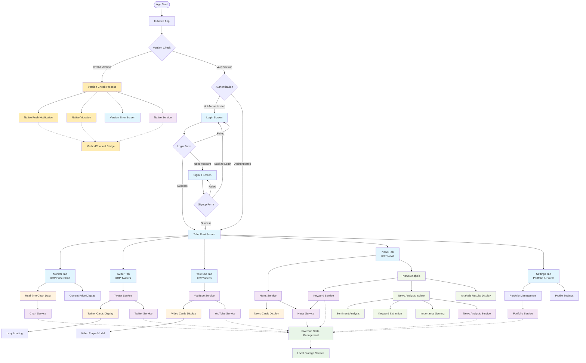

# 🚀 XRP Monitor - 실시간 XRP 암호화폐 모니터링 시스템

[](https://flutter.dev)
[](https://nestjs.com)
[](https://www.typescriptlang.org)
[](https://developer.mozilla.org/en-US/docs/Web/API/WebSocket)


## 📱 프로젝트 개요

XRP Monitor는 Flutter 기반의 실시간 암호화폐 모니터링 시스템으로, 다음 3개의 핵심 구성요소로 이루어져 있습니다:

- **📱 Flutter Mobile App** - 실시간 XRP 모니터링 모바일 애플리케이션
- **🌐 Flutter Web Admin** - 시스템 관리를 위한 웹 관리자 패널
- **⚡ NestJS Backend** - RESTful API 및 WebSocket 서버


## 🎯 주요 기능

### 📊 실시간 데이터 모니터링
- **WebSocket 기반** Upbit API 실시간 XRP 가격 추적
- **차트 시각화** fl_chart를 활용한 가격 변동 그래프
- **포트폴리오 관리** 개인 XRP 보유량 및 수익률 계산

### 📰 뉴스 및 소셜 미디어 집계
- **네이버 뉴스** API 연동 XRP 관련 뉴스 수집
- **Twitter API** XRP 관련 트윗 실시간 모니터링
- **YouTube API** XRP 분석 영상 자동 큐레이션

### 🔧 Flutter 구현 요소
- **Riverpod** 기반 상태 관리 with Code Generation
- **Auto Route** 선언적 라우팅 시스템
- **Freezed** 불변 데이터 모델 구조
- **WebView** 통합 브라우저 경험
- **Native Notifications** 네이티브 푸시 알림 및 진동 처리

## 🏗️ 아키텍처

### Flutter 애플리케이션 아키텍처

```
lib/
├── 🎯 core/
│   ├── models/          # Freezed 데이터 모델
│   ├── route/           # Auto Route 설정
│   └── services/        # API 서비스 계층
├── 🎪 service/
│   ├── authentication/ # JWT 인증 로직
│   └── storage/         # 로컬 스토리지
├── 🎨 ui/
│   ├── screen/          # 화면 위젯
│   ├── themes/          # Material Design 테마
│   └── utils/           # UI 유틸리티
└── 🧩 widgets/          # 재사용 위젯 컴포넌트
```

### 🛠️ 기술 스택

#### Frontend (Flutter)
```yaml
# 상태 관리
flutter_riverpod: ^2.6.1      # 강력한 상태 관리
hooks_riverpod: ^2.6.1        # React Hooks 스타일 API
riverpod_generator: ^2.4.0    # 코드 생성 지원

# 라우팅 & 네비게이션
auto_route: ^10.1.0+1         # 선언적 라우팅
auto_route_generator: ^10.1.0  # 라우트 코드 생성

# 데이터 모델링
freezed: ^3.0.6               # 불변 클래스 생성
json_serializable: ^6.8.0     # JSON 직렬화

# UI/UX
flutter_screenutil: ^5.9.3    # 반응형 UI
card_swiper: ^3.0.1          # 카드 스와이프
fl_chart: ^0.68.0            # 차트 라이브러리

# 네트워킹
dio: ^5.8.0+1                # HTTP 클라이언트
socket_io_client: ^3.1.2     # WebSocket 연결
```

#### Backend (NestJS)
- **TypeScript** 기반 견고한 타입 시스템
- **TypeORM** PostgreSQL 데이터베이스 ORM
- **Swagger** 자동 API 문서 생성
- **JWT** 인증 및 권한 관리
- **WebSocket** 실시간 데이터 스트리밍

## 🚀 시작하기

### Prerequisites
- Flutter 3.7.2+
- FVM (Flutter Version Management)
- Node.js 18+
- PostgreSQL 13+

### 설치 및 실행

#### 1️⃣ Flutter Mobile App
```bash
cd xrp_monitor_flutter_app

# 초기 설정 및 의존성 설치
./configure.sh

# 코드 생성 (권장: watch 모드)
./code_generator.sh

# 앱 실행
fvm flutter run
```

#### Android APK 다운로드
- 최신 APK: [app-release.apk](https://github.com/anotheranotherhoon/xrp_monitor_flutter_app/releases/download/v1.0.0%2B4/app-release.apk)
- 릴리즈 페이지: [v1.0.0+4](https://github.com/anotheranotherhoon/xrp_monitor_flutter_app/releases/tag/v1.0.0%2B4)
- GitHub Actions는 `v*` 태그가 push되면 release APK를 빌드하고 Release asset으로 업로드합니다.

#### 2️⃣ Flutter Web Admin
```bash
cd xrp_monitor_flutter_admin

# 설정 및 코드 생성
./configure.sh
./code_generator.sh

# 웹 관리자 패널 실행
fvm flutter run -d chrome
```

#### 3️⃣ NestJS Backend
```bash
cd xrp_monitor_nest_server

# 의존성 설치
npm install

# 개발 서버 시작
npm run start:dev

# API 문서 확인: http://localhost:3000/docs
```

### 테스트

#### Flutter 테스트 스위트
```bash
# 다양한 테스트 타입 실행
./test_runner.sh unit         # 단위 테스트
./test_runner.sh widget       # 위젯 테스트  
./test_runner.sh integration  # 통합 테스트
./test_runner.sh coverage     # 커버리지 리포트
```

#### Backend 테스트
```bash
npm test                      # 단위 테스트
npm run test:e2e             # E2E 테스트
npm run test:cov             # 커버리지
```

## 💡 핵심 Flutter 기술 구현

### 🎪 상태 관리 (Riverpod + Code Generation)
```dart
@riverpod
class PortfolioViewModel extends _$PortfolioViewModel {
  late final PortfolioService _portfolioService;

  @override
  FutureOr<PortfolioState> build() async {
    _portfolioService = ref.read(portfolioServiceProvider.notifier);
    return await fetchPortfolio();
  }

  Future<void> editPortfolio({
    required String quantity,
    required String averagePrice,
    String? memo,
  }) async {
    try {
      final response = await _portfolioService.editPortfolio(
        PortfolioRequest(
          quantity: double.parse(quantity),
          averagePrice: double.parse(averagePrice),
          memo: memo ?? ''
        )
      );
      
      if (response.success && response.result != null) {
        state = AsyncValue.data(PortfolioState(
          portfolio: response.result,
        ));
      }
    } catch(e) {
      state = AsyncValue.error(e, StackTrace.current);
      rethrow;
    }
  }
}
```

### 🛣️ 선언적 라우팅 (Auto Route)
```dart
@AutoRouterConfig()
class AppRouter extends RootStackRouter {
  AppRouter(this.ref);
  final Ref ref;

  @override
  List<AutoRoute> get routes => [
    // XRP Monitor TabsRootScreen 루트
    AutoRoute(
      page: TabsRootRoute.page,
      path: '/', guards: authGuards,
      children: [
        // XRP 가격 차트 및 실시간 모니터링
        AutoRoute(page: HomeRoute.page, path: 'monitor', initial: true),
        // XRP 관련 뉴스
        AutoRoute(page: NewsRoute.page, path: 'news'),
        // XRP 관련 트위터
        AutoRoute(page: TwitterRoute.page, path: 'twitter'),
        // XRP 관련 유튜브
        AutoRoute(page: YoutubeRoute.page, path: 'videos'),
        // 설정 및 프로필
        AutoRoute(page: SettingRoute.page, path: 'setting'),
      ],
    ),
  ];
}
```

### 🏗️ 불변 데이터 모델 (Freezed)
```dart
@freezed
abstract class Portfolio with _$Portfolio {
  const factory Portfolio({
    @JsonKey(name: 'hoIdx') @Default(0) int key,
    @JsonKey(name: 'hoQuantity') @Default('0') String quantity,
    @JsonKey(name: 'hoAveragePrice') @Default('0') String averagePrice,
    @JsonKey(name: 'hoTotalInvested') @Default('0') String totalInvested,
    @JsonKey(name: 'hoMemo') @Default('') String memo,
    @JsonKey(name: 'createdAt') @Default('') String createdAt,
    @JsonKey(name: 'updatedAt') @Default('') String updatedAt,
  }) = _Portfolio;

  const Portfolio._();

  factory Portfolio.fromJson(Map<String, dynamic> json) =>
      _$PortfolioFromJson(json);
}
```

### 📡 HTTP API 서비스 (Dio + Riverpod)
```dart
@riverpod
class NewsService extends _$NewsService {
  @override
  FutureOr<void> build() {}

  Future<ResponseModel<List<NewsModel>>> getNewsList({
    int cursorId = -1,
    int perPage = 10,
  }) async {
    final apiService = ref.read(apiServiceProvider.notifier);
    
    return await apiService.get<List<NewsModel>>(
      ApiPath.news,
      queryParameters: {'cursorId': cursorId, 'perPage': perPage},
      fromJson: (json) => (json as List)
          .map((item) => NewsModel.fromJson(item))
          .toList(),
    );
  }
}
```

## 📊 성능 최적화

### Flutter 최적화 기법
- **Code Generation**: 런타임 리플렉션 제거로 성능 향상
- **Lazy Loading**: `lazy_load_scrollview`를 통한 효율적 리스트 로딩
- **Memory Management**: Riverpod의 자동 dispose로 메모리 누수 방지
- **Image Optimization**: `flutter_native_splash` 및 최적화된 에셋 관리

## 🎬 데모 및 링크

### 📱 앱 데모 영상
- **모바일 앱 시연**: [YouTube 데모 링크 첨부 예정](#)
- **관리자 웹 패널**: [웹 데모 링크 첨부 예정](#)

### 🌐 라이브 데모 (배포 시)
- **사용자 앱 APK**: [app-release.apk](https://github.com/anotheranotherhoon/xrp_monitor_flutter_app/releases/download/v1.0.0%2B4/app-release.apk)
- **관리자 패널**: [https://admin.xrpmonitor.app](#)
- **API 문서**: [https://api.xrpmonitor.app/docs](#)

## 🏆 프로젝트 하이라이트

### 🎯 Flutter 전문성 입증
- **고급 상태 관리**: Riverpod Generator를 활용한 현대적 상태 관리
- **코드 생성 파이프라인**: Freezed, Auto Route, JSON Serialization 통합
- **테스트 전략**: Unit, Widget, Integration 테스트 포괄적 구현
- **반응형 UI**: ScreenUtil 기반 다양한 화면 크기 대응

### 💼 실무 수준 구현
- **코드 품질**: Lint 규칙 및 커밋 컨벤션 적용
- **보안**: JWT 인증, 민감 데이터 보호
- **실시간 처리**: WebSocket 기반 라이브 데이터 스트리밍

## 🔧 개발 환경 설정

### IDE 권장 설정
```jsonc
// .vscode/settings.json
{
  "dart.flutterSdkPath": ".fvm/flutter_sdk",
  "dart.lineLength": 80,
  "editor.rulers": [80],
  "editor.formatOnSave": true
}
```

### Git Hooks (Husky)
```bash
# 커밋 전 자동 린팅 및 테스트
npm run husky:setup
```

---

**🎯 이 프로젝트는 Flutter 고급 기술 스택을 활용한 실무급 암호화폐 모니터링 시스템으로, 현대적인 Flutter 개발 역량을 종합적으로 보여줍니다.**


## 📄 요구사항 정의서
[Google Sheets에서 보기](https://docs.google.com/spreadsheets/d/1YwO_8VIG5E_GJDIp3p9PIb81qf0KCz6gEm8AfujZwU4/edit?gid=1114121392#gid=1114121392)

## 📊 시스템 아키텍처

### 1. 앱 플로우 다이어그램 (App Flow Diagram)



### 2. 유스케이스 다이어그램 (Use Case Diagram)

```mermaid
  graph TB
%% Actors
    User((사용자))
    Guest((비회원 사용자))
    XRPSystem((XRP 데이터 시스템))
    NewsAPI((뉴스 API))
    TwitterAPI((트위터 API))
    YouTubeAPI((유튜브 API))
    KeywordAPI((키워드 API))

%% Authentication Use Cases
    subgraph "인증 관리"
        UC1[회원가입]
        UC2[로그인]
        UC3[로그아웃]
        UC4[세션 관리]
    end

%% XRP Monitoring Use Cases
    subgraph "XRP 모니터링"
        UC5[실시간 XRP 가격 조회]
        UC6[XRP 차트 조회]
        UC7[가격 알림 설정]
        UC8[실시간 캔들 데이터 수신]
    end

%% Portfolio Management Use Cases
    subgraph "포트폴리오 관리"
        UC9[포트폴리오 등록]
        UC10[포트폴리오 수정]
        UC11[포트폴리오 조회]
        UC12[수익률 계산]
    end

%% Content Consumption Use Cases
    subgraph "콘텐츠 소비"
        UC13[XRP 관련 뉴스 조회]
        UC14[XRP 관련 트윗 조회]
        UC15[XRP 관련 유튜브 영상 조회]
        UC16[영상 재생]
        UC17[트위터 lazy loading]
    end

%% News Analysis Use Cases
    subgraph "뉴스 분석 (Isolate)"
        UC24[뉴스 감성 분석]
        UC25[뉴스 키워드 추출]
        UC26[뉴스 중요도 점수 계산]
        UC27[키워드 관리]
        UC28[분석 결과 화면 표시]
        UC29[백그라운드 분석 처리]
    end

%% Settings Use Cases
    subgraph "설정 관리"
        UC18[앱 설정 변경]
        UC19[프로필 관리]
        UC20[버전 체크]
    end

%% Native System Use Cases
    subgraph "네이티브 시스템 알림"
        UC21[네이티브 푸시 알림 표시]
        UC22[네이티브 진동 실행]
        UC23[MethodChannel 통신]
    end

%% User relationships
    User --> UC1
    User --> UC2
    User --> UC3
    User --> UC4
    User --> UC5
    User --> UC6
    User --> UC7
    User --> UC8
    User --> UC9
    User --> UC10
    User --> UC11
    User --> UC12
    User --> UC13
    User --> UC14
    User --> UC15
    User --> UC16
    User --> UC17
    User --> UC18
    User --> UC19
    User --> UC24
    User --> UC25
    User --> UC26
    User --> UC27
    User --> UC28
    User --> UC29

%% Guest relationships
    Guest --> UC1
    Guest --> UC2
    Guest --> UC20
    Guest --> UC21
    Guest --> UC22

%% External system relationships
    XRPSystem --> UC5
    XRPSystem --> UC6
    XRPSystem --> UC8
    NewsAPI --> UC13
    NewsAPI --> UC24
    NewsAPI --> UC25
    NewsAPI --> UC26
    KeywordAPI --> UC27
    KeywordAPI --> UC24
    KeywordAPI --> UC25
    TwitterAPI --> UC14
    TwitterAPI --> UC17
    YouTubeAPI --> UC15
    YouTubeAPI --> UC16

%% Native system relationships
    subgraph "네이티브 플랫폼"
        AndroidSystem((Android 시스템))
        iOSSystem((iOS 시스템))
    end
    AndroidSystem --> UC21
    AndroidSystem --> UC22
    AndroidSystem --> UC23
    iOSSystem --> UC21
    iOSSystem --> UC22
    iOSSystem --> UC23

%% Use case dependencies
    UC2 -.-> UC4
    UC3 -.-> UC4
    UC5 -.-> UC8
    UC6 -.-> UC8
    UC11 -.-> UC12
    UC14 -.-> UC17
    UC15 -.-> UC16
    UC20 -.-> UC21
    UC20 -.-> UC22
    UC21 -.-> UC23
    UC22 -.-> UC23
    UC13 -.-> UC24
    UC13 -.-> UC25
    UC24 -.-> UC26
    UC25 -.-> UC26
    UC24 -.-> UC29
    UC25 -.-> UC29
    UC26 -.-> UC29
    UC27 -.-> UC24
    UC27 -.-> UC25
    UC29 -.-> UC28

%% Authentication requirements
    UC5 -.-> UC2
    UC6 -.-> UC2
    UC7 -.-> UC2
    UC9 -.-> UC2
    UC10 -.-> UC2
    UC11 -.-> UC2
    UC13 -.-> UC2
    UC14 -.-> UC2
    UC15 -.-> UC2
    UC18 -.-> UC2
    UC19 -.-> UC2
    UC24 -.-> UC2
    UC25 -.-> UC2
    UC26 -.-> UC2
    UC27 -.-> UC2
    UC28 -.-> UC2
    UC29 -.-> UC2

%% Styling
    classDef actor fill:#e1f5fe,stroke:#01579b,stroke-width:2px
    classDef usecase fill:#f3e5f5,stroke:#4a148c,stroke-width:1px
    classDef system fill:#fff3e0,stroke:#e65100,stroke-width:2px

    class User,Guest actor
    class XRPSystem,NewsAPI,TwitterAPI,YouTubeAPI,KeywordAPI,AndroidSystem,iOSSystem system
    class UC1,UC2,UC3,UC4,UC5,UC6,UC7,UC8,UC9,UC10,UC11,UC12,UC13,UC14,UC15,UC16,UC17,UC18,UC19,UC20,UC21,UC22,UC23,UC24,UC25,UC26,UC27,UC28,UC29 usecase

```


