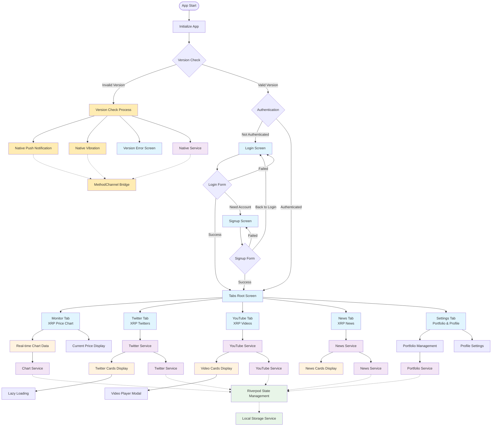

# flutter_default_project

A new Flutter project.

## Getting Started

This project is a starting point for a Flutter application.

A few resources to get you started if this is your first Flutter project:

- [Lab: Write your first Flutter app](https://docs.flutter.dev/get-started/codelab)
- [Cookbook: Useful Flutter samples](https://docs.flutter.dev/cookbook)

For help getting started with Flutter development, view the
[online documentation](https://docs.flutter.dev/), which offers tutorials,
samples, guidance on mobile development, and a full API reference.

## 📄 요구사항 정의서
[Google Sheets에서 보기](https://docs.google.com/spreadsheets/d/1YwO_8VIG5E_GJDIp3p9PIb81qf0KCz6gEm8AfujZwU4/edit?gid=1114121392#gid=1114121392)

```mermaid
  graph TB
%% Actors
    User((사용자))
    Guest((비회원 사용자))
    XRPSystem((XRP 데이터 시스템))
    NewsAPI((뉴스 API))
    TwitterAPI((트위터 API))
    YouTubeAPI((유튜브 API))

%% Authentication Use Cases
    subgraph "인증 관리"
        UC1[회원가입]
        UC2[로그인]
        UC3[로그아웃]
        UC4[세션 관리]
    end

%% XRP Monitoring Use Cases
    subgraph "XRP 모니터링"
        UC5[실시간 XRP 가격 조회]
        UC6[XRP 차트 조회]
        UC7[가격 알림 설정]
        UC8[실시간 캔들 데이터 수신]
    end

%% Portfolio Management Use Cases
    subgraph "포트폴리오 관리"
        UC9[포트폴리오 등록]
        UC10[포트폴리오 수정]
        UC11[포트폴리오 조회]
        UC12[수익률 계산]
    end

%% Content Consumption Use Cases
    subgraph "콘텐츠 소비"
        UC13[XRP 관련 뉴스 조회]
        UC14[XRP 관련 트윗 조회]
        UC15[XRP 관련 유튜브 영상 조회]
        UC16[영상 재생]
        UC17[트위터 lazy loading]
    end

%% Settings Use Cases
    subgraph "설정 관리"
        UC18[앱 설정 변경]
        UC19[프로필 관리]
        UC20[버전 체크]
    end

%% Native System Use Cases
    subgraph "네이티브 시스템 알림"
        UC21[네이티브 푸시 알림 표시]
        UC22[네이티브 진동 실행]
        UC23[MethodChannel 통신]
    end

%% User relationships
    User --> UC1
    User --> UC2
    User --> UC3
    User --> UC4
    User --> UC5
    User --> UC6
    User --> UC7
    User --> UC8
    User --> UC9
    User --> UC10
    User --> UC11
    User --> UC12
    User --> UC13
    User --> UC14
    User --> UC15
    User --> UC16
    User --> UC17
    User --> UC18
    User --> UC19

%% Guest relationships
    Guest --> UC1
    Guest --> UC2
    Guest --> UC20
    Guest --> UC21
    Guest --> UC22

%% External system relationships
    XRPSystem --> UC5
    XRPSystem --> UC6
    XRPSystem --> UC8
    NewsAPI --> UC13
    TwitterAPI --> UC14
    TwitterAPI --> UC17
    YouTubeAPI --> UC15
    YouTubeAPI --> UC16

%% Native system relationships
    subgraph "네이티브 플랫폼"
        AndroidSystem((Android 시스템))
        iOSSystem((iOS 시스템))
    end
    AndroidSystem --> UC21
    AndroidSystem --> UC22
    AndroidSystem --> UC23
    iOSSystem --> UC21
    iOSSystem --> UC22
    iOSSystem --> UC23

%% Use case dependencies
    UC2 -.-> UC4
    UC3 -.-> UC4
    UC5 -.-> UC8
    UC6 -.-> UC8
    UC11 -.-> UC12
    UC14 -.-> UC17
    UC15 -.-> UC16
    UC20 -.-> UC21
    UC20 -.-> UC22
    UC21 -.-> UC23
    UC22 -.-> UC23

%% Authentication requirements
    UC5 -.-> UC2
    UC6 -.-> UC2
    UC7 -.-> UC2
    UC9 -.-> UC2
    UC10 -.-> UC2
    UC11 -.-> UC2
    UC13 -.-> UC2
    UC14 -.-> UC2
    UC15 -.-> UC2
    UC18 -.-> UC2
    UC19 -.-> UC2

%% Styling
    classDef actor fill:#e1f5fe,stroke:#01579b,stroke-width:2px
    classDef usecase fill:#f3e5f5,stroke:#4a148c,stroke-width:1px
    classDef system fill:#fff3e0,stroke:#e65100,stroke-width:2px

    class User,Guest actor
    class XRPSystem,NewsAPI,TwitterAPI,YouTubeAPI,AndroidSystem,iOSSystem system
    class UC1,UC2,UC3,UC4,UC5,UC6,UC7,UC8,UC9,UC10,UC11,UC12,UC13,UC14,UC15,UC16,UC17,UC18,UC19,UC20,UC21,UC22,UC23 usecase

```

